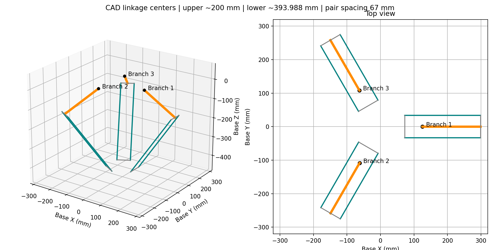
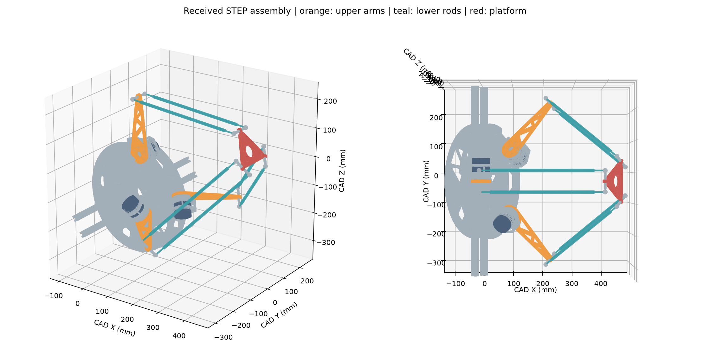

# 真实机械臂 STEP 接收与几何评审

更新：2026-10-10。本轮已完成真实装配读取、几何特征提取、连杆尺寸与坐标系整理，进入 pipeline 的 P5 几何准备部分。以下是 **CAD 提取结果**，尚未经过实物标定，不是可直接发送给电机的运行配置。

## 1. 数据来源与处理方式

| 项目 | 记录 |
| --- | --- |
| 原文件 | `Delta 机械臂(1).step`，原文件留在本地 robot 根目录 |
| 大小 | 18,647,892 bytes |
| SHA256 | `93b8c6db575d29a76050ddd1a1d3053732322ea168e9a12c09ae7b00522e2fa0` |
| STEP schema | AP214 / AUTOMOTIVE_DESIGN |
| 源文件时间戳 | 2026-10-09 21:14:23 +08:00 |
| 顶层装配名称 | `Delta 机械臂 v9`；这是 CAD 内部名称，不当作已签署的设计版本 |
| 几何单位 | STEP 几何上下文为 mm，角度为 rad |
| 解析工具 | Python 3.13 + cadquery-ocp 8.0.1.1.0 / OpenCascade；CAD 工具与仿真环境分开 |
| 装配统计 | 169 个装配/零件实例，其中 154 个叶零件实例；重复零件按实际装配次数计数 |

按 XCAF 装配树累计每层刚体变换，把圆柱轴线、球面中心和零件几何变到 STEP 世界坐标。表格中的中心距来自这些解析几何特征，不使用零件包围盒代替连杆运动学长度。完整原始特征见 [assembly.json](cad/assembly.json)，零件目录见 [parts.csv](cad/parts.csv)。

包围盒通过叶零件的紧致几何包围盒合并获得。普通 B-rep 包围算法对某些裁剪曲面会产生极大的保守包围范围，本次改用叶零件 `AddOptimal`，避免把该算法结果误报成数百米大的机械臂。

STEP 中可识别三台 `DM-J4310-2EC-V1.1_3d_20260228_1` 电机装配，与昨日手册型号一致；这支持 CAD 型号对应关系，但实物铭牌和固件仍需核对。模型包含支架、固定/顶层碳板、2020 铝型材、主动臂、从动杆和末端平台；未识别到球拍及其专用夹具。

## 2. 与当前仿真的尺寸对照

| 几何量 | 新 STEP 提取值 | 旧 delta_sim 值 | 解释 |
| --- | ---: | ---: | --- |
| 主动臂肩轴至肘轴中心距 | 名义 200 mm | 100 mm | 新模型约 2 倍；按球面拟合中心计算为 199.999470 mm |
| 从动杆两端球面中心距 | 393.987779 mm，六杆相同 | 200 mm | 不应直接取碳管裸管长度，也不应擅自改成 400 mm |
| 肩中心径向距离 | 125 mm 径向，另有 0.25 mm 切向偏置 | 74.5 mm | 中心到肩点的欧氏距离约 125.00025 mm |
| 平台每组球铰中点径向距离 | 72.209915 mm，另有 0.25 mm 切向偏置 | 约 24.94 mm | 中点距平台参考中心约 72.210348 mm；不是单个球铰半径 |
| 一对从动杆的球铰间距 | 67 mm，上下两端一致 | 约 52.4 mm | 完整六点坐标优于简化成单一半径 |
| CAD 参考姿态平台高度 | 基座坐标 Z = −422.734210 mm | 不作直接对比 | 单个装配姿态，不是工作空间边界 |
| CAD 参考姿态主动臂角 | 约 −30.00175° | 编码器零位未定义 | 以径向水平为几何零角、向上为正；不代表电机原始反馈 |
| 电机 1 包围尺寸 | 57 × 46 × 57 mm | 手册表 56 mm / 图 Ø57 mm | CAD 支持 Ø57、轴向 46 的图纸口径，实际安装仍须测量 |
| 整套装配轴对齐包围盒 | CAD X/Y/Z 约 586.366 / 624.883 / 531.399 mm | 不作直接对比 | 包含安装架，随 CAD 姿态变化，不是可达空间 |

因此真实机构与旧仿真不能仅统一乘一个比例。旧仿真的逆运动学、工作空间、轨迹尺寸、基座/球台相对位置、球拍偏移和击球性能均需在新模型上重新验证。当前 26/30 在线回球统计仍只适用于旧仿真。





第一张是从真实球心与轴线绘制的几何示意，不包含杆件外形或碰撞体；第二张是实际 B-rep 三角化预览，使用 STEP 原坐标显示，不是动力学运行画面。

## 3. 基座坐标与关节命名准备

为了后续 MuJoCo 和 ROS 2 使用一致单位，建立一个**候选机械基座坐标系**：原点为三个肩中心的平均值，肩中心是对应电机/主动臂轴线在该组上球铰中面上的投影点。+X 为第一支链径向，+Y 与第一支链横轴对应，+Z 背离平台，采用右手系。

CAD 原点平移参考（mm）：

```text
o_CAD = [62.5, -28.75, -108.253175473]
R_base_from_CAD =
[-0.5,          0,  0.8660254038]
[ 0,            1,  0           ]
[-0.8660254038,  0, -0.5         ]

p_base_m = R_base_from_CAD × (p_CAD_mm − o_CAD_mm) / 1000
```

[geometry.json](cad/geometry.json) 同时保存上述旋转、原点和齐次变换。使用齐次变换矩阵时先把输入点换成米，不要重复除以 1000。平台参考点定义为六个下球铰中心的平均值；球拍夹具安装面及工具中心需要另建 frame，不能把该参考点直接当成安装表面。

| CAD 支链 | 主动臂实例 | 肩中心 base/mm | 建议正转轴 base | 旧仿真中同方位的名字（仅参考） |
| --- | --- | --- | --- | --- |
| 1 | `主动臂:1` | (125, 0.25, 0) | (0, −1, 0) | motor_arm_joint3 |
| 2 | `主动臂:2` | (−62.283494, −108.378175, 0) | (−0.866025, 0.5, 0) | motor_arm_joint1 |
| 3 | `主动臂:3` | (−62.716506, 108.128175, 0) | (0.866025, 0.5, 0) | motor_arm_joint2 |

正转轴按“关节角增大时主动臂抬高”选择。最后一列仅用于理解两个模型的方位，**未确定新机的 joint name/CAN ID/电机序列号映射**，不能按数组序号直接给真实电机发送命令。

ROS 2 后续应保留 `cad_reference`、`base_link`、三条主动支链、`platform` 和 `tool` 的明确定义。URDF 用树描述视觉和三主动关节接口，从动关节位姿由闭链几何求解；MuJoCo 使用球铰/闭环约束。当前 STEP 没有可直接导入的运动副及机械转角限制。

## 4. 必须保留的疑点

### 4.1 材料属性不能用于真实惯量

41 个零件定义的密度属性全部为 **7850 kg/m³**，材料描述全部为“钢”，包括名称为固定碳板、碳杆和 2020 铝材的零件。这更像统一默认赋值，不能据此计算可信整机质量、重心和惯量。

`assembly.json` 的 `geometric_volume_mm3` 是纯几何体积，`volume_centroid_mm` 是均匀密度下的几何质心，均不当作实测质量/重心。电机也不能把所有内部 CAD 零件体积乘钢密度；手册约 300 g 只能作总质量初始参考，转子/定子及减速器反射惯量还需厂家数据或辨识。

需补实际材料清单、各运动组件称重及夹具/紧固件/线缆负载。确认后才能生成可信 MuJoCo 惯量和动力学用 URDF inertial。

### 4.2 碳管与球心存在约 0.167 mm 偏置

六组配对采用源装配顺序，并用对应碳管圆柱轴线交叉核对。两端球心连线方向与各自杆轴基本平行，但球心到碳管轴线距离最大约 **0.167250 mm**。`geometry.json` 中每杆保存偏距、夹角和 review 标志。

这是源装配的几何不一致或建模细节，不应通过修改结果抹掉。还存在两端球面拟合导致的数微米差异，以及每条支链一致的 0.25 mm 切向偏移。当前保存实际提取坐标，后续请机械设计者明确哪些是装配偏置、哪些是公差/模型误差；实机 FK 标定后再决定是否简化成理想对称参数。

### 4.3 无法从此 STEP 得到的参数

- 电机编码器零位、方向、CAN ID、固件、模式和完整驱动协议。
- 机械止挡、球铰摆角极限、线缆约束和允许工作空间。
- 真正的材料、质量、惯量、刚度、摩擦及传动间隙。
- 装机后基座到球台/相机的外参，球拍和夹具几何、质量及安装基准。
- 电路、制动/承托、通信超时与电机动态的实测参数。

因此本轮不产出带猜测质量、猜测关节限位的“实机可运行模型”，也不改变旧仿真参数来宣称已经完成 sim2real。

## 5. 可复现的数据生成

CAD 解析是离线工具，不加入原仿真的运行依赖。已有 JSON/CSV/PNG 可以直接查看；需要重新解析时可在独立 Python 3.13 环境安装：

```powershell
conda create -n delta-cad python=3.13 pip -y
conda activate delta-cad
python -m pip install cadquery-ocp==8.0.1.1.0 matplotlib==3.11.2
```

进入仓库根目录，把 STEP 路径替换为收到的文件位置：

```powershell
python delta_real/import_step.py "<STEP文件的完整路径>" --preview
python delta_real/derive_geometry.py --plot
```

第一个命令输出 `assembly.json`、`parts.csv` 和 B-rep 预览；第二个命令输出 SI 单位的 `geometry.json` 和尺寸图。工具针对本次 AP214 装配和已识别特征编写；新的 CAD 版本若改名/改结构，需要重新确认特征选择。球心-管轴的 1 mm / 0.1° 程序守卫只用于发现错配，不是机构精度验收标准；超过 0.1 mm 的偏距仍以待确认项记录。

原始 STEP 未随仓库复制，摘要内保存哈希用于核对版本。上述命令需要自行提供该文件；所有图和参数均能从原文件重新生成。

## 6. 接下来的实施顺序

1. 机械设计者确认 200 mm 主动臂、393.987779 mm 球心距是否与制造尺寸一致，解释碳管/球心偏距及 0.25 mm 横向偏置。
2. 确认材料、称重和球拍夹具；定义真实关节名字、电机编号、几何零角、限位与从动球铰活动范围。
3. 用当前真实六点坐标建立独立的闭链几何模型，先验证装配参考姿态及 IK/FK 连续性，再添加受实测约束的动力学。
4. 按组件刚性连接关系简化视觉网格，生成 ROS 2 description；对固定电机壳体与旋转输出件分别归属，避免整台电机随上臂转动。
5. 并行继续昨天的完整 CAN 协议、电路和单电机台架工作。P5 几何提取已有输入，P3/P4 的硬件条件仍未满足。

详见 [PIPELINE](PIPELINE.md)。
