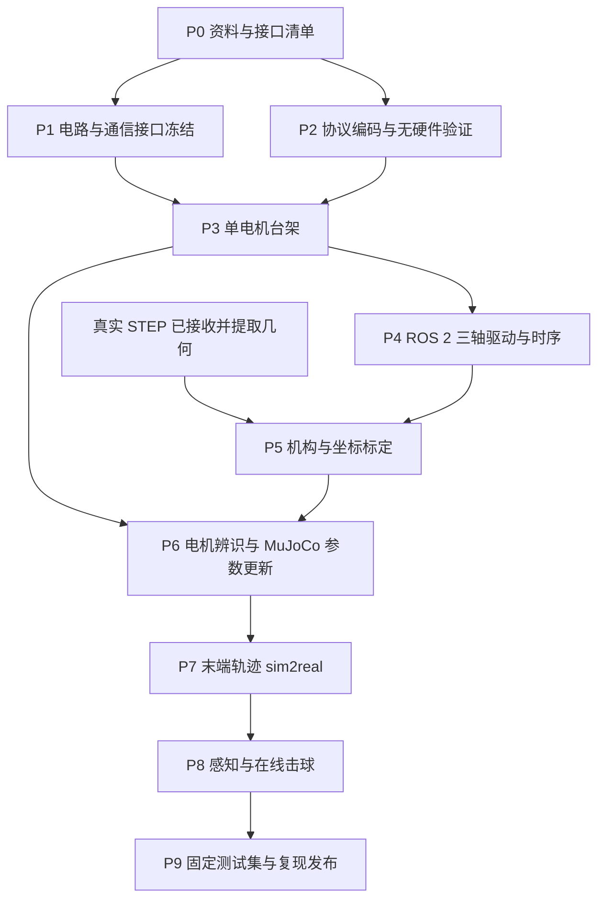
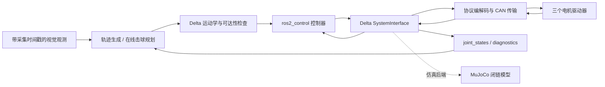

# Delta sim2real 实施 pipeline（ROS 2）

更新：2026-10-10。本文是后续工作的执行路线与交付约定；各阶段尚未进行实机验收。手册依据、页码和协议疑点见 [MOTOR_MANUAL_NOTES.md](MOTOR_MANUAL_NOTES.md)，待填参数见 [hardware_pending.yaml](config/hardware_pending.yaml)。真实 STEP 已接收，P5 几何提取部分已完成，数据与待核实事项见 [CAD_REVIEW.md](CAD_REVIEW.md)。

## 1. 当前起点和最终目标

最终目标有两个：真实 Delta 机械臂复现末端几何轨迹；在平台刚性安装竖直球拍后，根据实时观测完成连续来球的在线回击。控制系统使用 ROS 2，MuJoCo 用于模型验证、控制器验证和实测数据回放。

| 已有资料/能力 | 当前边界 |
| --- | --- |
| MuJoCo 轨迹和在线击球程序 | 几何、质量、驱动和接触参数尚未按实际设备标定 |
| DM-J4310-2EC V1.1 九页手册 | 实物型号/固件待核对，完整驱动控制协议未收到 |
| 电路设计进行中 | CAN 转接、供电、急停、再生能量及保护方案待定 |
| 已收到真实 STEP，主动臂约 200 mm、从动杆球心距约 393.988 mm | 真实关节映射、实测质量/惯量、限位和球拍夹具待确认；不同于旧仿真 |
| 在线 30 球仿真参考结果 26/30 | 每球复位，来球范围窄；不是实机成功率或任意来球能力 |

当前已有协议需求、电路接口约定、ROS 2 分层、记录格式及 CAD 连接点数据；收到完整协议后可开始纯软件通信编码。机械几何可继续独立建模；动力学、工作空间及实机执行仍需要材料、限位和台架资料。

不得把模板中的 `null` 自动替换成旧仿真数值。手册规格、设计候选值、实测值、最终批准运行值分别记录；修改运行值需要留下依据和版本。

## 2. 阶段依赖与交付节奏

每阶段以交付物和验收证据结束，不仅以“能动了”为结束条件。硬件/电气、机械、驱动、控制和感知的负责人在开始阶段时确定；同一人可负责多个角色。每周记录已关闭问题、剩余阻塞、参数变更和下一阶段输入。

## 3. ROS 2 系统设计

### 3.1 平台和传输选择

建议实机控制主机使用 Ubuntu 24.04 LTS + ROS 2 Jazzy，作为拟选基线，安装时固定实际包版本。现有 Windows Conda 仿真环境继续用于当前仿真；ROS 2 控制工作空间独立维护，避免把 Conda 依赖混入系统 ROS 环境。硬件控制的周期性、CAN 驱动兼容和时间戳必须在最终 Linux 主机上测量。

优先考虑 Linux 原生 SocketCAN 兼容适配器；厂家 USB 调试工具是否提供 SocketCAN、SDK、收发时间戳和稳定周期通信需要单独确认。如果使用 MCU 桥接，上位机与 MCU 协议需包含版本、序号、有效期、关节映射、状态和错误检查；它是额外的一层驱动，不能当作透明且无延迟的 CAN 线。

### 3.2 数据路径

规划器只依赖明确的观测和关节状态接口，不能从实机路径读取仿真真值。MuJoCo 与硬件后端共享关节名字、单位和命令语义，允许用同一任务输入对比。现有 Python 程序直接调用 MuJoCo，需要逐步拆出运动学/规划计算和 I/O；它目前不是 ROS 2 节点，不能仅加一层 topic 就宣称已经完成移植。

### 3.3 后续工作空间划分（计划，当前未创建代码包）

| 拟建包 | 职责 | 开始条件 |
| --- | --- | --- |
| `delta_description` | URDF/Xacro、TF、惯量、标定参数引用和可视化 | 真实机械资料到达后 |
| `damiao_transport` | CAN 传输、codec、帧校验、状态解码；尽量不依赖 ROS | 完整协议明确后 |
| `delta_hardware` | C++ `ros2_control::SystemInterface`，三轴映射和生命周期 | 无硬件协议验证完成后 |
| `delta_controllers` | 关节轨迹/阻抗适配、限速和在线命令有效期 | 先 mock，后单轴确认 |
| `delta_mujoco` | MuJoCo 与控制接口桥接，发布时钟及受控观测 | 接口定义冻结后 |
| `delta_tasks` | 轨迹任务、在线拦截规划、工作空间约束 | 通用计算从当前脚本拆出后 |
| `delta_bringup` | mock/sim/real 明确分开的 launch、参数及控制器加载 | 对应后端实现后 |
| `delta_interfaces` | 标准消息不足时补充带有效期的命令/观测和状态 | 消息字段评审后 |

初期不必一次建立全部包。先做 transport、hardware 和最小 bringup，再按依赖增加；避免只有空目录却没有可验证功能。

### 3.4 控制模式与接口语义

状态接口至少包含三个主动关节的 `position`（rad）、`velocity`（rad/s）、`effort`（N·m，驱动估算值），并通过诊断发布故障、温度、反馈年龄和通信状态。只有完成单位/减速比确认后才能填入标准关节状态；没有反馈不能伪造为 0。

**初始台架/低速阶段：**可评估位置速度模式，但其速度字段是最大绝对速度，不是 `JointTrajectory` 的速度前馈。必须明确限速如何配置、内部梯形轨迹与外部轨迹插值是否冲突，并通过台架验证响应。

**动态轨迹/击球候选：**评估 MIT 模式的 `p_des/v_des/Kp/Kd/t_ff`。由一个明确的控制器管理这些字段与饱和约束；可设计 position/velocity/effort 及增益的命令接口，但增益不必每周期通过 ROS topic 改写。选定 ros2_control/JTC 版本后核对其支持的接口组合；标准控制器不能直接覆盖 MIT 的全部语义时，写专用适配控制器。

不同时运行外部位置 PID、JTC effort PID 和电机 MIT 位置环来重复施加未分析的反馈。保留一个负责闭环策略的明确层次。驱动位置控制时 Kd 非零；具体增益来自台架，不复制仿真 `kp=3000, kv=45`。模式切换只在规定的静止/失能状态执行，清空过期队列后重新初始化命令。

低速长轨迹可使用 `FollowJointTrajectory` action；击球在线重规划若采用短轨迹更新，应定义替换生效时间、连续性和过期处理，避免用不断取消 action 的方式未经测量地获得高频控制。每个时刻只能有一个控制器拥有三轴命令权限。

### 3.5 频率与 CAN 预算

候选主控频率 500 Hz（2 ms），须通过实测确认；先在低频建立可靠通信，再提高。MuJoCo 物理步长 0.5 ms 不意味着硬件必须以 2 kHz 收发。

按三个轴每周期各一帧 8 字节命令和一帧反馈估算，每秒 `3×2×500=3000` 帧。经典 CAN 标准数据帧考虑帧间隔和位填充，工程粗估每帧约 111–135 bit，对应 1 Mbps 下约 33–41% 总线占用；1 kHz 则约 67–81%。这只是预算，不包含重传、其他节点、额外状态帧和适配器缓存，反馈频率还需协议确认。项目候选目标为稳态占用不超过约 50%，最终以抓包和最坏负载测量决定周期。

CAN 仲裁是顺序发送，三个关节不会真正同时收到命令。记录每轴收发时间和三轴时间偏差，不声称存在手册未给出的硬件同步锁存。若适配器延迟或偏差不可接受，再评估独立总线或 MCU 定时转发。

硬件 `read()/write()` 使用有界、非阻塞或有限等待的设计；RX 线程维护带单调时间戳的快照。控制线程避免动态分配、磁盘写入和逐帧日志；记录通过有界队列交给非实时线程，队列满时报告丢弃。记录周期超时次数、P50/P95/P99/最大延迟；Linux 实时调度和 CPU 设置只能在最终主机上验证，不能用平均值宣称硬实时。

## 4. P0：资料接收与接口台账（现在）

任务：

1. 核对三台实物型号、序列号、驱动固件和调试助手版本，归档参数导出；手册型号仅作初始线索。
2. 索取固件对应的完整达妙控制协议、特殊帧、参数读写、模式切换、零位和超时设置说明及官方收发例程。
3. 闭合手册疑点：反馈 D0 的 ID/ERR 位宽、定点映射、P/V/T 量程、角度输出侧定义、编码器跨圈、温度/扭矩有效性。
4. 电路负责人填写下节接口清单。机械负责人后续提供电机装配方式、主动/从动臂尺寸及负载。
5. 参数模板保留未知值为空；每项新增来源、确认人、日期和证据文件位置。

交付：`hardware_pending.yaml` 的首轮填写、协议疑点清单的答复、协议版本和参数文件哈希。验收：实现 codec 必须用到的字段没有歧义；电路设计输入有明确负责人。若完整协议未到，只做接口草案和日志格式，不写猜测的使能报文。

## 5. P1：电路与接口冻结（电路设计期间）

| 设计项 | 需要给软件/台架工作的信息 |
| --- | --- |
| 24 V 供电 | 电压工作区间、限流、三轴同时加速容量、压降、保险、线径和连接器载流能力 |
| 电流口径 | 2.5/7.5 A 是母线还是相电流、RMS 还是峰值；不要直接乘三选电源 |
| 减速回馈 | 再生能量如何处理、电源是否能吸收、母线测量及过压保护方案 |
| CAN 网络 | 适配器/MCU 型号、驱动、拓扑、线缆、共地/隔离、屏蔽、终端位置 |
| 终端电阻 | 常规 CAN 两端各 120 Ω 是设计候选；先核对电机和适配器内置终端，避免重复接入 |
| 电机接口 | XT30 电源/CAN 针脚视图和线序、GH1.25 调试接口电平和线序 |
| 急停与复位 | 独立硬件急停链、接触器/制动、反馈输入、重启联锁及人工复位条件 |
| 失能承托 | 平台重力下降如何由机械支撑/制动控制；切断电源的后果需实测评估 |
| 调试与测量 | CAN 抓包、母线电压/电流、急停状态和温度的可测位置及接口 |

保护阈值与正常运行限值分开制定。手册 120°C 驱动保护、≤100°C 电机保护建议和 ≤32 V 过压建议均不是正常运行目标。电路不得假定 ROS 节点、USB 连接或 CAN 失能帧始终可用。

交付：原理图版本、连接器表、CAN 拓扑图、BOM/适配器资料、急停和失能行为说明。验收：硬件负责人确认接线及供电保护，台架有限位/承托和适当限流；上电前检查表由实际电路生成，不由当前缺资料的模板代替。

## 6. P2：通信代码与无硬件验证

获得完整协议后实现纯 codec：模式地址、位域、大小端、浮点格式、量化、特殊指令、反馈故障解析。CAN ID、字段范围、NaN/Inf、错误 DLC、未知状态和错误节点反馈全部显式检查。编码量程与运行限值分别存储，不能用编码满量程代替允许运动范围。

建立无硬件传输和 Linux `vcan` 路径，使用厂家已知报文向量验证端点、零点、中间值和解码；测试丢帧、乱序、重复、超时、断开重连。`vcan` 不模拟真实仲裁、USB 延迟或电气故障，真实时序留到台架阶段。

参数缺失、ID 冲突、协议版本不兼容时 configure 失败；程序启动默认不发送使能。控制命令与配置命令分开；保存零位/持久化参数等动作禁止在周期循环中自动执行。

交付：独立 codec/transport、报文向量、无硬件测试报告。验收：协议疑点已关闭，错误输入不生成有效运动命令；序号和时间戳行为可追踪。

## 7. P3：单电机台架（先不连接 Delta 闭链）

按“断电接线核对 → 上电只读状态 → 配置确认 → 受限使能 → 小幅低速往返 → 故障行为”顺序推进。启用时先读取当前位置，并以当前位置初始化目标，避免默认零目标造成突然跳转。第一次方向确认在独立电机或断开负载的受控台架完成，不能在闭链装配后逐轴随意转动。

记录正方向、零位、单圈边界、重启行为、位置/速度/扭矩口径；外部角度参考用来核对输出轴单位和减速比。若协议反馈已是减速器输出轴角度，内部 10:1 不再额外施加。

在限幅内对比位置速度和 MIT 模式的阶跃/平滑轨迹响应，逐步辨识延迟、摩擦、死区、速度与力矩饱和及热漂移。试验波形和幅值先根据台架限制制定，不直接使用击球轨迹。实际电流与负载力矩测量可用时用于核对驱动估算值。

安排受控的停止发命令、拔通信、节点退出、驱动报错和急停试验，记录最终机械状态与恢复条件；失能后再次连上设备不自动恢复运动。

交付：每台电机身份与参数、CAN 抓包、台架数据、方向/零位表、初始增益与运行限幅、故障处理证据。验收：小幅动作方向/幅度正确，停止及重启行为明确，无过流/过温；反馈与指令能按时间对应，实测误差阈值在试验前确定。

## 8. P4：ROS 2 三轴驱动与时序

把三台主动电机组织成一个 `SystemInterface`，对三轴状态的一致性和共同故障负责。一个轴反馈过期或故障时，整组进入规定停止策略，避免其他两轴继续追踪破坏闭链。三轴总线验证先在独立台架完成，再接入机构。

建议生命周期：

| 状态 | 行为 |
| --- | --- |
| Unconfigured | 不发送运动命令，校验配置及协议支持 |
| Inactive | 通信和状态读取可用，驱动未授权运动 |
| Active | 联锁满足、反馈新鲜、命令由当前位置平滑衔接后使能 |
| Fault/Stopping | 锁存故障；根据通信和承托条件执行已验证的停止策略 |
| 恢复 | 人工确认原因、清除故障、重新校验状态；不自动恢复旧目标 |

区分三级超时：任务命令有效期、主机反馈超时、电机驱动通信看门狗。阈值按实测延迟和停止距离确定，填写到正式运行配置；任何一级不能仅依赖上一层仍活着。主机失效时硬件急停链和驱动看门狗仍需有定义行为。

发布 `/joint_states`、`/diagnostics` 和故障状态；记录每关节反馈年龄及三轴采样偏差。使用标准 ROS 时间戳供消息/回放，使用单调时钟计算超时；实机禁用仿真时钟。无设备时用 mock 后端，real launch 默认不使能，明确显示当前后端和配置版本。

交付：hardware 插件、带配置检查的 bringup、三轴时序报告和故障矩阵。验收：额定候选频率下无无界积压；最坏反馈年龄和三轴偏差满足事先制定的控制预算；三轴共同停机与人工恢复可重复。

## 9. P5：收到机械资料后的标定

2026-10-10 进展：已提取 169 个装配/零件实例、154 个叶零件，保存三肩轴、十二球心、六杆长度、67 mm 成对间距及 CAD 到候选基座坐标变换。已生成装配预览和几何图。P5 尚未完成实物验收，下一步按以下顺序推进：

1. 核对 200/393.987779 mm 中心距、0.25 mm 切向偏置及约 0.167 mm 球心-碳管轴线偏距。
2. 确认实际材料和称重；STEP 的 41 个密度属性全部为钢/7850 kg/m³，不能作为真实惯量。
3. 建立三主动臂、六从动杆、平台的刚体归属，电机固定壳体与旋转输出盘分别处理。
4. 基于真实六点坐标构建闭链几何；校验参考姿态及多姿态运动，再加入质量/驱动模型。工作空间扫描前补机械止挡与球铰摆角限制。
5. 完成球拍夹具设计及 tool frame 后，再迁移旧仿真的末端路径、球台布置与在线击球。

当前可复用 `cad/geometry.json` 的几何数据，不可直接使用它作为 ros2_control 的电机配置。

接收 STEP/装配图、上下臂长度、基座/动平台连接点、球铰偏置、电机轴姿态、传动关系、关节限位、质量惯量、球拍夹具与线缆约束。逐项标明 CAD 值和实测值。电机外径 56/57 mm 的冲突应由正式图纸和实物关闭。

统一右手坐标系与单位 m/kg/s/rad/N·m；建议 TF 链含 `world/table/base/platform/paddle/camera`。每台电机到关节的关系独立标定：若 `theta_out` 已为减速器输出轴角度，定义 `q = sign × (theta_out − theta_zero) / r_external`，其中 `r_external` 是输出轴转角/关节转角。速度和力矩映射需按同一传动约定、效率及物理侧定义推导，不能只改角度。

零位通过装配基准或夹具测量，不以“启动时的姿态”为零位；区分软件偏移和电机永久保存零位。跨圈处理结合实际关节范围和掉电恢复，不能对异常跳变盲目 unwrap。

Delta 是闭链：URDF 的树状表示用于 TF、可视化及三主动关节接口；从动关节由几何求解得到，不能全部用简单固定比例 mimic 代替。MuJoCo 保留真实闭链约束；核对不同姿态下的平台位置、方向及闭环残差。实际关节顺序按名称映射，不能依赖 XML/报文数组偶然顺序。

交付：标定表、真实参数 URDF/Xacro 与 MuJoCo 模型、质量惯量来源、工作空间/奇异区/限位图。验收：外部测量与 FK 在独立姿态集上误差可量化，IK 分支连续；无法通过机构或线缆限制的轨迹在发送前被拒绝。

## 10. P6：电机模型与 sim2real 参数辨识

先拟合单轴，再验证装配后的多轴重力耦合。MuJoCo 驱动模型至少加入实测控制模式、延迟与抖动、采样保持、编码量化、速度/力矩/电流饱和、传动摩擦和必要的间隙近似。控制限幅应考虑连续扭矩、峰值时长和转速相关能力；仅写一个 ±7 N·m 常数不足以描述电机能力。

对相同的、事先固定的输入波形比较仿真与实测位置、速度、相位延迟、峰值和温升；辨识数据与验证数据分开。用参数扰动覆盖测量不确定性，保留参数区间和拟合残差，不只展示拟合最好的曲线。

现有 20 rad/s 上限约 191 rpm，高于额定 120 rpm；±6 N·m 高于额定 3 N·m。因此原控制器需要重做受实机约束的规划，不能凭当前 30 球拍速合格就判定电机合格。MIT 的编码增益范围与 MuJoCo 位置伺服不是可直接交换的参数。

交付：电机/机构参数版本、训练与验证数据划分、仿真-实测叠图和误差表。验收：在目标工作区间内满足预先约定的模型误差，模型之外的工况被限制；未实现的热/接触细节在报告中列明。

## 11. P7：末端轨迹迁移

按关节小幅平滑轨迹、低速笛卡尔直线、圆、8 字、带圆角方形/星形、螺旋逐级扩展。方形和星形的几何尖角需要停顿或平滑过渡，不能要求有限电机在非零速度下瞬时换向。螺旋 Z 方向先核对坐标变换和单调升降，再增加范围。

轨迹由真实工作空间和测得关节速度、加速度、jerk、力矩及停止距离约束生成。先在更新模型下运行同一轨迹，随后在实机低速执行。末端外部测量用于判断真实路径，仅由编码器 FK 推算的误差不能作为几何精度真值。

每条轨迹记录期望/实际 q、末端路径、跟踪 RMS/最大误差、延迟、闭环残差、饱和比例、温度和约束事件；按运动时间对齐而非只匹配轨迹形状。连续运行评估漂移和温升。

交付：与仿真入口对应的 ROS 2 轨迹任务、轨迹数据和对比报告。验收：在已标定工作空间内达到项目提前约定的误差/速度标准，全部关节满足约束，重复执行和停止可控。毫米级误差指标待真实机构确定，不在资料缺失时先承诺数值。

## 12. P8：视觉与在线击球迁移

先完成相机内外参、相机到球台/机械臂的变换和时间同步，再做球轨迹记录。每帧必须区分采集时间和消息到达时间；滤波器状态预测到计划执行时刻，不能把旧观测当作“现在”的位置。

端到端预算覆盖曝光、传输、检测、估计、规划、ROS 排队、CAN、驱动和机械响应，报告各段分布及总延迟。当前仿真 80 ms 观测延迟、100 ms 计算发布预算只是开发设置；实机重新测量。超时计划丢弃，允许放弃不可达球，不能跳变命令强行追球。

依次开展：记录真实来球但机械臂静止 → bag 离线预测/拦截回放 → MuJoCo 接入相同观测 → 实机空挥 → 受限单球 → 连续 10 球 → 固定方案 30 球与多组种子/发球序列。发球只根据规则和标定后工作空间筛选，不预演回球成功后才挑选。

真实球拍安装、拍面恢复系数、摩擦、自旋和空气阻力需要辨识；相机不能直接测到的自旋应作为估计/未知量处理。回球判定使用实际过网和对方台面落点；分别统计接触率、项目严格回球率、正式规则回球率（如实现擦网合法判定），不要混用。

实机逐球不具备 MuJoCo 瞬间复位能力：发球状态机为“回位完成且状态正常 → 请求一球 → 确认来球 → 拦截或放弃 → 观察落点 → 回位”。串行发球由机械臂 ready 与发球机 ack/超时共同控制；场内上一球、拾球和额外球检测需明确，不能直接把仿真每球 reset 搬上硬件。

交付：带时间戳的观测接口、在线任务、发球同步状态机、落点记录和失败分类。验收：固定测试集不剔除失败球，报告总球数、合法且可达发球数、接触/回球数、弃球原因、运动约束、温升和超时；与仿真使用相同判定口径比较，不预先承诺 100%。

## 13. P9：记录、发布与后续迭代

每次实验保存一份 manifest：Git commit、ROS/OS/内核版本、MuJoCo 版本、模型/标定哈希、电机序列号/固件、CAN 配置、模式与增益、限幅、时钟来源、任务轨迹/种子、开始结束时间、是否中断及原因。

建议记录 ROS bag（任务、状态、诊断、带采集时间的观测）、CAN 原始帧及主机单调时间、外部末端测量和必要视频。数据中同时保留编码器位置、估算末端、外部测量末端，不把三者合并为同一“实际位置”。体积大的 bag/视频在数据存储中管理，Git 保留 manifest、摘要及必要小样本。

每次更新先跑已冻结的回归轨迹和发球集合，再做新场景；参数拟合用的数据不作为唯一的验证数据。README 只提供已实现且经过对应阶段验证的命令，计划中的包和运行步骤明确标注状态。

## 14. 近期工作清单

- [ ] 核对三台电机铭牌、固件与参数导出；收到完整驱动协议。
- [ ] 电路负责人确认 CAN 适配器/MCU、供电/回馈、急停、失能承托与引脚定义。
- [ ] 定义通信字段和三轴 ID 分配，再创建 `damiao_transport`。
- [ ] 在 Linux mock/vcan 环境完成协议和错误路径验证。
- [ ] 电路就绪后安排单电机台架，确认模式、方向、单位和时序。
- [x] 已接收 STEP 并完成 P5 的装配、轴线、球心和坐标提取。
- [ ] 确认 CAD 偏置、材料/质量、真实关节映射、限位与球拍夹具，再完成 P5 标定及新模型。
- [ ] 依据台架结果决定 ROS 2 控制模式、运行频率及限幅，不沿用旧仿真默认值。

推进原则：先让每个阶段的输入、参数和验收结果可追溯，再进入下一阶段。当前并行推进协议/电路接口确认和已接收 CAD 的几何核对；两者在单轴驱动与真实机构标定后汇合。
